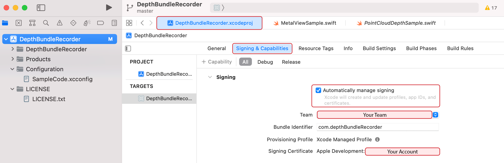
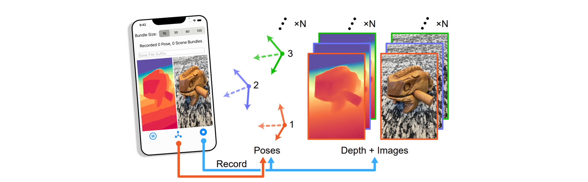

# iOS App for Depth Bundle Recording

This is part of the official code repository for the work: [The Implicit Values of A Good Hand Shake: Handheld Multi-Frame Neural Depth Refinement
](https://arxiv.org/abs/2111.13738).

If you use parts of this work, or otherwise take inspiration from it, please considering citing our paper:
```
@article{chugunov2021implicit,
  title={The Implicit Values of A Good Hand Shake: Handheld Multi-Frame Neural Depth Refinement},
  author={Chugunov, Ilya and Zhang, Yuxuan and Xia, Zhihao and Zhang, Cecilia and Chen, Jiawen and Heide, Felix},
  journal={arXiv preprint arXiv:2111.13738},
  year={2021}
}
```

Our app for recording depth bundles is based on [this code for displaying a point cloud using scene depth]( https://developer.apple.com/documentation/arkit/environmental_analysis/displaying_a_point_cloud_using_scene_depth), and we highly recommend you read through that page if you want to familiarize yourself with the structure and function of its code.

## Getting the App Running
1. Open the `.xcodeproj` project file with Xcode (tested for Xcode 13).
2. Set up signing and provisioning. You'll have to make an Apple developer account if you don't have one already. Check the `Automatically manage signing` box to simplify this process.

3. Plug in your device (in our case an iPhone 12 Pro), and trust it. It should appear in the list of devices at the top of Xcode. Select it as the device to build/deploy to.
4. Build the app, its icon should now appear on the phone.
5. As this is an app not from the app store, you will have to trust the developer in your settings under `Settings / General / VPN & Device Management` (This location may depend on your iOS version).

6. You should now be able to run the app.

## Using the App

1. Use the sliding bar at the top to select how many frames to record per capture: 15,30,60,120 frames or equivalently 0.25s, 0.5s, 1s, 2s of recording time.
2. Enter a suffix (or leave blank). Saved bundles will be titled `{capture_time}_{suffix}.bin`.
3. Press the button on the left to pause recording, the button in the middle to record a pose-only bundle (no video or depth recording), or the button on the right to record pose, images, and LiDAR depth.
4. The button will disappear while the data is being captured, and the count at the top of the app will update accordingly.

## Processing the Recorded Bundles
1. We recommend you use [ios-deploy](https://github.com/ios-control/ios-deploy) to download recorded bundles from the phone. To do this simply run:  
```ios-deploy -w /Documents --bundle_id 'com.depthBundleRecorder'```   
2. To delete the bundles from the phone you can then run:  
```ios-deploy -X /Documents --bundle_id 'com.depthBundleRecorder'```  
If you do this, close and restart the app to update the counts at the top.
3. **Rename the folder containing the binaries to `data_{name_of_your_choice}`.**
4. To convert the binary bundle files into `.npz` files as described in the main repo, run:  
```python ConvertBinaries.py -d data_{name_of_your_choice}```  
This will create a folder `data_processed_{name_of_your_choice}` with the processed `.npz` files and preview first/last images of the recorded data.
